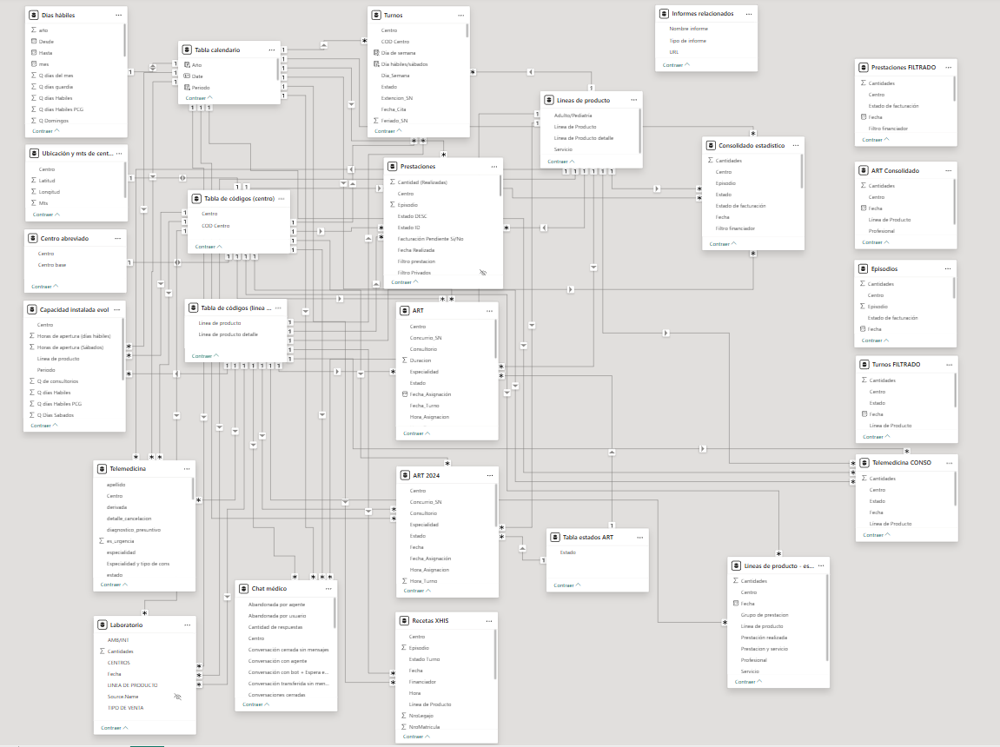

# Multi-source-Data-Consolidation-in-Power-BI
Engineered a multi-source data consolidation workflow in Power BI. Implemented product-specific transformations and standardized metrics to support cross-system comparative reporting. The model follows a star schema with several fact tables and multiple dimension tables.

## Problem Context

Multiple operational systems with inconsistent schemas, naming conventions, and business rules needed to be consolidated into a unified analytical model to enable cross-product performance comparison. Note: Sensitive information has been anonymized due to confidentiality constraints.

## Technical Challenges

- Inconsistent column structures across systems
- Different metric definitions by product line
- Missing fields in certain sources
- Varying levels of granularity
- Need for standardized reporting structure

## Modeling Strategy

- Source-level normalization using Power Query
- Product-specific transformation logic
- Standardized column mapping using SELECTCOLUMNS
- Consolidation via UNION
- Implementation of a star schema
- Centralized calendar dimension

### Star Schema Model

### Multi-source Consolidation

Example of schema standardization and dataset unification using UNION and SELECTCOLUMNS to align heterogeneous structures into a consistent fact table.

.png)

### UNION example

.png)

### FILTER example

.png)

### Final consolidation (extract)

.png)

## Analytical Layer and Reporting

The final model supports executive dashboards focused on productivity, capacity, and service status analysis. Below is an example of a general executive visualization. The reporting layer includes calculated measures and conditional logic using DAX functions such as CALCULATE, IF, DISTINCTCOUNT, SUM, AVERAGE, and conditional filtering with IN expressions to support dynamic KPI analysis. All visualizations support dynamic filtering through interactive slicers and controls.

.png)

### Installed Capacity Analysis

The model also enables installed capacity analysis in both graphical and tabular formats. Office utilization is calculated as:

Utilization Rate = DIVIDE([Scheduled Hours], [Theoretical Hours], 0)

Where:
- Scheduled Hours represent total booked hours.
- Theoretical Hours are calculated as:
  Number of Offices × Business Days × Opening Hours per Location.

.png)

.png)

### Appointment Status Trend Over Time and the Appointment Status Distribution

As a final example, a dedicated dashboard was developed to analyze deviations in appointment status, identify trends over time, and detect patterns in appointment blocking and client no-shows.

